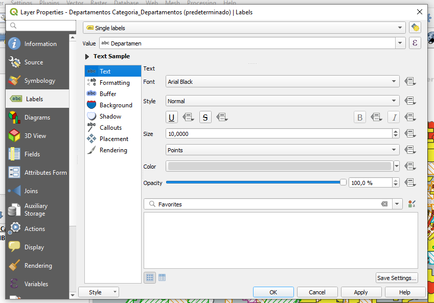
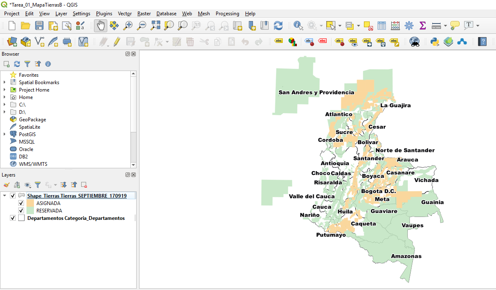

# Tarea 01

## MAPA DE TIERRAS

Mapa web de bloques de Hidrocarburos en Colombia

##  Cuál es el problema a tratar?

Conocer que uso se le está dando al territorio colombiano en cuanto a la explotación de recursos no renovables dentro del sector hidrocarburífero 

##  Por qué un mapa ayuda a resolverlo?

Porque el mapa permite mostrar de manera gráfica la especialización de las áreas y el estado en que se encuentran los bloques de Hidrocarburos. Además, con la opción de los metadatos se puede conocer más información acerca de cada bloque 

## Descripción del mapa temático

(Variable seleccionada, utilidad)

## Descripción de los métodos de clasificación seleccionados

Cual es mejor para la variable seleccionada? Por qué?

## Fuente de datos

Departamentos
https://www.datos.gov.co/Mapas-Nacionales/Departamentos-y-municipios-de-Colombia/xdk5-pm3f

Mapa de Tierras
http://www.anh.gov.co/hidrocarburos/oportunidades-disponibles/mapa-de-tierras

##  Herramientas

- QGIS
- QgisCloud

##  Proceso Realizado

### Instalación de Software
1. Se descargo el programa QGis
2. En QGis se instaló del pluggin de QGisCloud
3. Se creó cuenta en QgisCloud 

### Descarga de insumos
1. Se descargó en formato shapefile los Departamentos de la página de datos abiertos de MinTic
2. Se descargó en formato shapefile el Mapa de Tierras de 2019 de la página de la Agencia Nacional de Hidrocarburos

### Creación de Mapas en QGis

1. Se adicionan los shapefiles de “Departamentos” y “Mapa de Tierras”
2. Se establece la simbología del Mapa de Tierras por medio de categorías:

Se realizaron dos mapas, utilizando dos variables para la definición de las categorías
3. El primer mapa corresponde a las categorías definidas por medio del atributo (Value) Leyenda. Se da clic en la opción “Classify” y aparecerán los valores de este atributo:

4. De acuerdo a la simbología establecida por la ANH para definir los bloques de tierras, se asigna los colores a cada categoría:

5. Se realiza el mismo procedimiento con todas las categorías y se obtiene la siguiente clasificación:

6. De la misma manera se establece la simbología para la capa “Departamentos” de manera simple con un contorno gris. Adicionalmente se prenden los labels que permitan visualizar el nombre de cada departamento:

### Resultado Mapa 1

7. Para el segundo mapa las categorías se definen por medio del atributo (Value) Clasificación; el cual corresponderá únicamente a si el bloque está “Asignado” o es un “Área Reservada”. Para este caso se eliminan los bordes, lo que permitirá observar de manera continua el color. 

### Resultado Mapa 2

### Publicación de los Mapas por medio QGisCloud

## Ventajas / Desventajas 
/ dificultades / diferencias encontradas al utilizar QGIS para el desarrollo del ejercicio

##  Urls

- Mapa Web https://qgiscloud.com/dersteppenwolf/qgis_mapa_rutas_2/?bl=&st=&l=rutas-habiles-zonales%20Rutas%20H%C3%A1biles%20Zonales&t=qgis_mapa_rutas_2&e=-74.38875%2C4.48498%2C-73.77022%2C4.79034

- WMS https://qgiscloud.com/dersteppenwolf/qgis_mapa_rutas_2/wms?SERVICE=WMS&REQUEST=GetCapabilities

