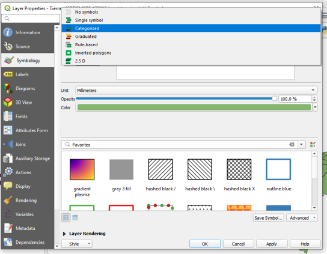
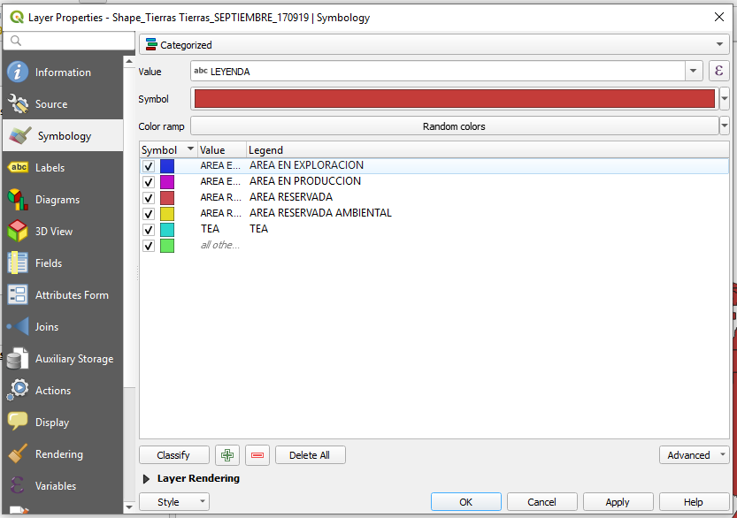
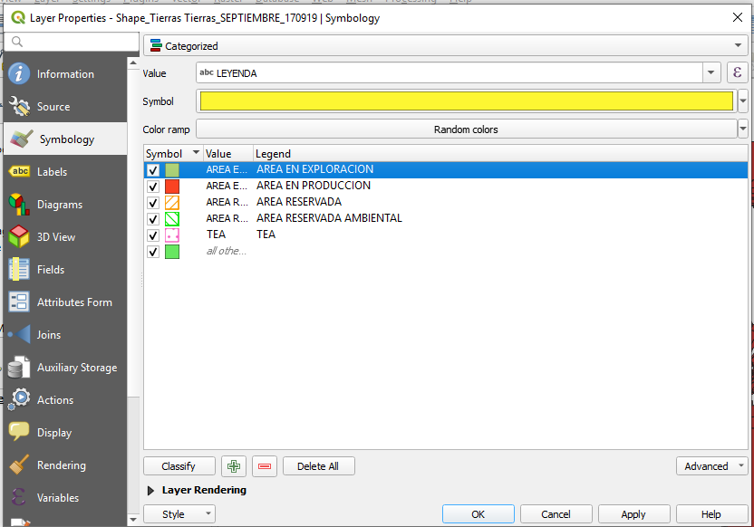
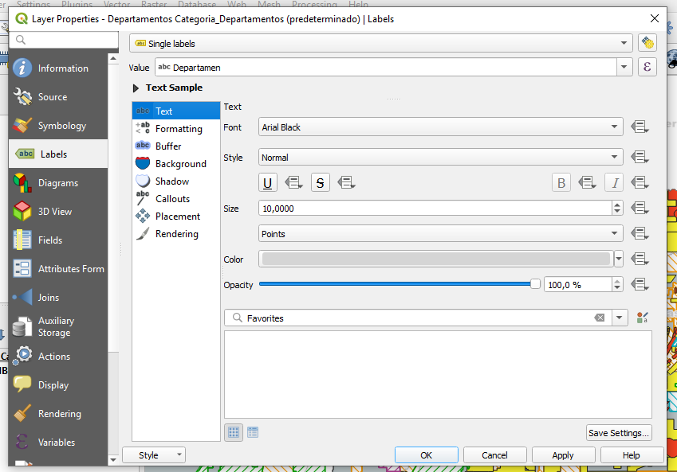
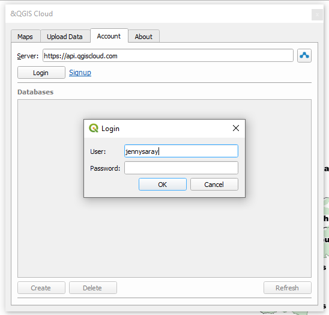
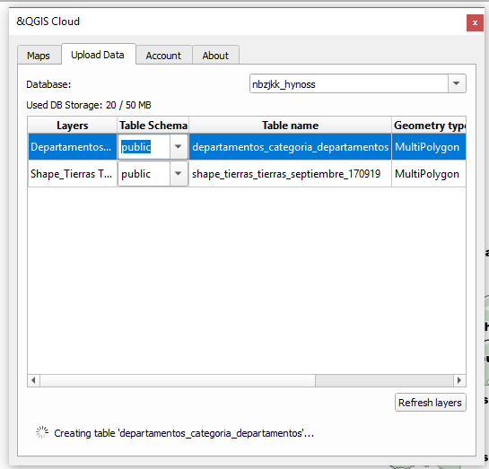
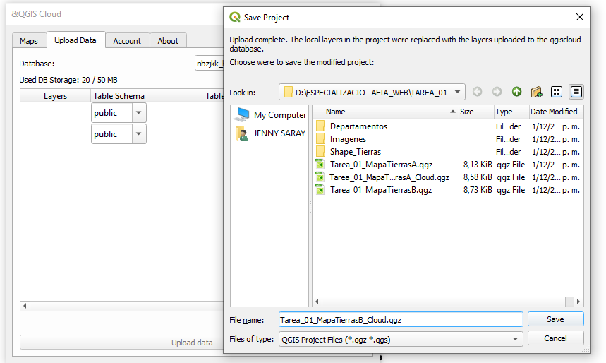
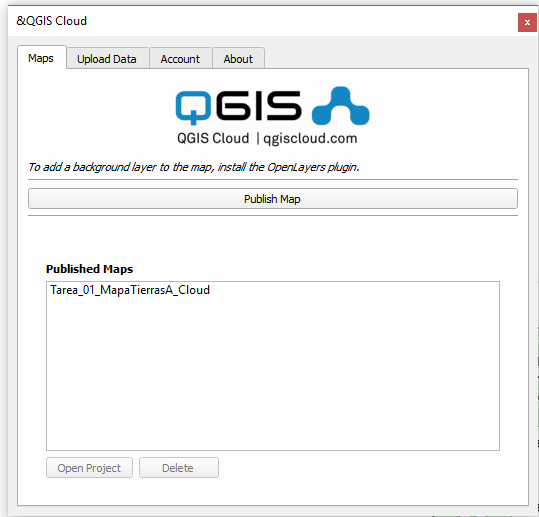
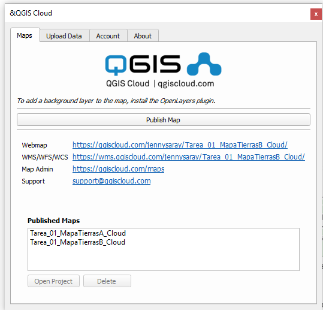
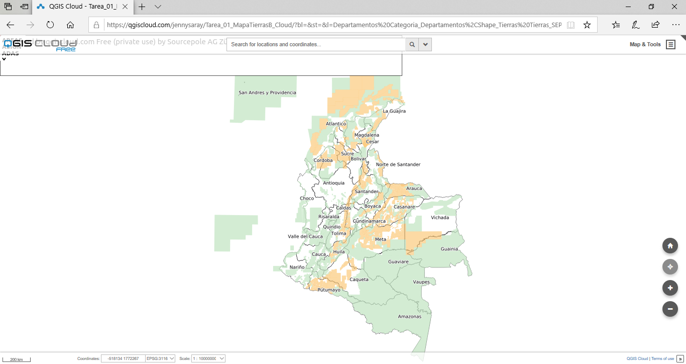

# Tarea 01

## MAPA DE TIERRAS

Mapa web de bloques de Hidrocarburos en Colombia.

##  Cuál es el problema a tratar?

Conocer que uso se le está dando al territorio colombiano en cuanto a la explotación de recursos no renovables dentro del sector hidrocarburífero.

##  Por qué un mapa ayuda a resolverlo?

Porque el mapa permite mostrar de manera gráfica la especialización de las áreas y el estado en que se encuentran los bloques de Hidrocarburos. Además, con la opción de los metadatos se puede conocer a mayor profundidad la información de cada bloque.

## Descripción del mapa temático

El MAPA DE TIERRAS permite visualizar el estado y la distribución de los bloques en Colombia, consiste en mostrar el territorio en polígonos con una representación de color y atributos con la información de los contratos presentes.

## Descripción de los métodos de clasificación seleccionados

Se realizó la clasificación por medio de dos categorías:

### Leyenda
Esta variable combina los atributos de Clasificación, Estado de Área y Tipo de Contrato, de los bloques de hidrocarburos, con lo cual, se puede observar de manera entendible el uso del suelo que se le está dando a un área específica en cuanto a la explotación de recursos. Por medio de este variable se observa un mapa con las siguientes categorías:
-	Área en Exploración 
-	Área en Producción
-	Área Reservada
-	Área Reservada Ambiental
-	TEA (Evaluación Técnica con ANH)

### Clasificación 
Esta variable permite observar fácilmente el área que se encuentra asignada para algún proceso de exploración y/o explotación de hidrocarburos, así como las áreas que son Reservadas principalmente por temas ambientales. Por medio de este variable se observa un mapa con las siguientes categorías:
-	Asignada
-	Reservada

## Fuente de datos

Departamentos
https://www.datos.gov.co/Mapas-Nacionales/Departamentos-y-municipios-de-Colombia/xdk5-pm3f

Mapa de Tierras
http://www.anh.gov.co/hidrocarburos/oportunidades-disponibles/mapa-de-tierras

##  Herramientas

- QGIS
- QgisCloud

##  Proceso Realizado

### Instalación de Software
1. Se descargó el programa QGis
2. En QGis se instaló del plugins de QGisCloud
3. Se creó cuenta en QgisCloud 

### Descarga de insumos
1. Se descargó en formato shapefile los Departamentos de la página de datos abiertos de MinTic
2. Se descargó en formato shapefile el Mapa de Tierras de 2019 de la página de la Agencia Nacional de Hidrocarburos

### Creación de Mapas en QGis

1. Se adicionan los shapefiles de “Departamentos” y “Mapa de Tierras”
2. Se establece la simbología del Mapa de Tierras por medio de categorías:

Se realizaron dos mapas, utilizando dos variables para la definición de las categorías

3. El primer mapa corresponde a las categorías definidas por medio del atributo (Value) Leyenda. Se da clic en la opción “Classify” y aparecerán los valores de este atributo:

4. De acuerdo a la simbología establecida por la ANH para definir los bloques de tierras, se asigna los colores a cada categoría:

5. Se realiza el mismo procedimiento con todas las categorías y se obtiene la siguiente clasificación:

6. De la misma manera se establece la simbología para la capa “Departamentos” de manera simple con un contorno gris. Adicionalmente se prenden los labels que permitan visualizar el nombre de cada departamento:

### Resultado Mapa 1

7. Para el segundo mapa las categorías se definen por medio del atributo (Value) Clasificación; el cual corresponderá únicamente a si el bloque está “Asignado” o es un “Área Reservada”. Para este caso se eliminan los bordes, lo que permitirá observar de manera continua el color. 

### Resultado Mapa 2

### Publicación de los Mapas por medio QGisCloud

8. Se abre la ventada “Cloud Settings” y se ingresa el usuario y contraseña de la cuenta creda en el numeral 3:

9. En la ventana “Upload Data” se agregan a la GDB de la nube las capas del mapa

10. Cuando termina de ejecutarse el paso anterior, aparecerá una ventana en la que se guardara el proyecto:

11. Finalmente en la pestaña “Maps” se publica el mapa:

### Visualización de los Mapas en QGisCloud

12. En el navegador se ingresa a la cuenta de Qgis Cloud en la cual se podrán observar los mapas creados. Ejemplo:

## Comentarios acerca de QGIS para el desarrollo del ejercicio

### Ventajas
- Se pueden realizar mapas sencillos por medio de herramientas de acceso libre no pagas
- Se tiene un entorno de programa fácil de entender para usuarios nuevos en cuanto a las herramientas básicas de simbología 

### Desventajas 
- Presentó falla de ejecución durante el desarrollo de los procesos
- Fue necesaria la depuración de la información de la capa "Mapa de Tierras" ya que presentaba conflicto para subir los datos a la nube
- No fue posible realizar el ejercicio por medio del plugins QGis2Web, ya que una vez se intentaba abrir la ventada para publicar el mapa se cerraba el programa

##  Urls

### MapaTierrasA - Categorias por Leyenda
https://qgiscloud.com/jennysaray/Tarea_01_MapaTierrasA_Cloud/?bl=&st=&l=Shape_Tierras%20Tierras_SEPTIEMBRE_170919%2CDepartamentos%20Categoria_Departamentos&t=Tarea_01_MapaTierrasA_Cloud&e=-905886%2C286380%2C2708322%2C2024693

WMS: https://qgiscloud.com/jennysaray/Tarea_01_MapaTierrasA_Cloud/wms?SERVICE=WMS&REQUEST=GetCapabilities

### MapaTierrasB - Categorias por Calsificación
https://qgiscloud.com/jennysaray/Tarea_01_MapaTierrasB_Cloud/?bl=&st=&l=Departamentos%20Categoria_Departamentos%2CShape_Tierras%20Tierras_SEPTIEMBRE_170919&t=Tarea_01_MapaTierrasB_Cloud&e=-703963%2C510968%2C2910245%2C2249281

WMS: https://qgiscloud.com/jennysaray/Tarea_01_MapaTierrasB_Cloud/wms?SERVICE=WMS&REQUEST=GetCapabilities
