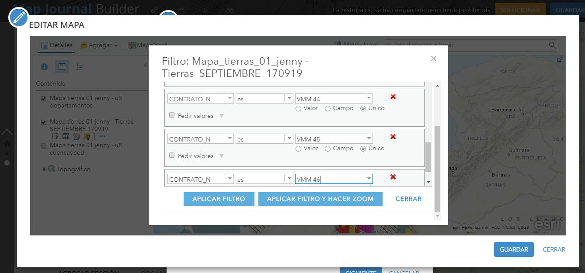

# Tarea 02

## DESCRIPCIÓN DE LAS ÁREAS DEL MAPA DE TIERRAS Y CARACTERIZACIÓN DEL DEPARTAMENTO DE CESAR 

##  Cuál es el problema a tratar?

Conocer la clasificación de las áreas del mapa de tierras para el país y las áreas ofertadas para el departamento de Cesar en el proceso competitivo permanente

##  Por qué una experiencia interactiva ayuda a resolverlo?

Porque permite conocer, no solo los atributos de la clasificación de las áreas, sino además se tiene acceso al concepto que lo describe. Permite tener un panorama del país para luego dinámicamente moverse a la zona de interés y hacer un análisis a profundidad acerca de los conceptos expuestos.

## Descripción de los datos 

### Mapa de tierras

*Tipos de geometría:* Vector – Polígono 

*Atributos:* Nombre de Contrato, Estado del Bloque, Clasificación, Tipo de Contrato, Operador, Yacimiento, Cuenca, Área

*Sistema de referencia:* MAGNA_Colombia_Bogota

*Url para descarga:* http://www.anh.gov.co/hidrocarburos/oportunidades-disponibles/mapa-de-tierras 

### Cuencas Sedimentarias

*Tipos de geometría:* Vector – Polígono

*Atributos:* Nombre cuenca

*Sistema de referencia:* MAGNA_Colombia_Bogota

*Url para descarga:* http://www.anh.gov.co/Informacion-Geologica-y-Geofisica/Cuencas-sedimentarias

##  Descripción del procesamiento realizado a los datos

Los datos utilizados fueron los descargados en las páginas mencionadas anteriormente:
-	Mapa de tierras, fue utilizado en los diferentes mapas sin ningún procesamiento geográfico. Para el despliegue de la información que se requería se usaron únicamente filtros en la herramienta de publicación ArcGis Online
-	Cuencas Sedimentarias, fue utilizado en los diferentes mapas sin ningún procesamiento geográfico. 

##  Descripción de las diferentes técnicas y métodos utilizados para la visualización de datos

Se creó un mxd base en ArcGis con la simbología deseada, la cual, para el caso del mapa de tierras fue descargada de la misma Url del mapa en formato .lyr. Para las cuencas se generó una simbología por categoría de nombre y los departamentos se dejaron en simbología sencilla de limite.
Este mxd se publicó como servicio y fue lavase para la generación de todas las vistas. Dese la herramienta de publicación ArcGis Online, se realizaron los filtros y cambios de simbología requeridos 

##  Descripción del procedimiento realizado 

La historia tiene como fin explicar la clasificación de las áreas del mapa de tierras y con ello hacer el acercamiento a un departamento en el cual se puedan observar las áreas en exploración y producción así como las áreas ofertadas en el proceso permanente de asignación de áreas:

1. Se ingresa a ArcGis Online y se selecciona una plantilla que sirva para mostrar la temática deseada

2. En el PASO 1 se selecciona el tipo de archivo que se desea mostrar, para este caso en la primera vista se adiciono una imagen en la parte derecha:

3. En el PASO 2 se selecciona el tipo de archivo que se desea mostrar, para este caso en la primera vista se adiciono un texto que explica que es un Mapa de Tierras:

4. En las vistas posteriores se desea mostrar mapas en la parte derecha y descripción en la parte izquierda, por ello para la generación del mapa, se dio simbología a las capas en Desktop y se publicó como servicio: 

5. Se ingresa usuario y clave de ArcGis Online y se guarda como servicio:

6. Se agrega una nueva sección, pero esta vez en el PASO 1 se selecciona la opción crear un mapa:

7. En la ventana emergente se adiciona la capa guardada como servicio: 

8. En esta ventana es posible realizar los ajustes deseados en la visualización del mapa y una vez ajustado se da clic en guardar: 

9. Nuevamente en el PASO 2 se adiciono texto que explica los conceptos de la clasificación del Mapa de Tierras

10 . Se realiza el mismo procedimiento para las vistas posteriores de ingreso de mapa en el PASO 1 y descripción en el PASO 2 con la diferencia de ir realizando la edición en cada mapa para mostrar la información deseada en el acercamiento (zoom) adeudado. En este ejercicio se realizaron principalmente procesos de filtrado:   

*FILTRO PARA LA CAPA DEPARTAMENTOS SELECCIONANDO CESAR 

*FILTRO PARA LA CAPA MAPA DE TIERRAS SELECCIONANDO LOS BLOQUES DEL PROCESO PERMANENTE DE ASIGNACIÓN DE ÁREAS DEL DEPARTAMENTO DE CESAR 

*FILTRO PARA LA CAPA MAPA DE TIERRAS SELECCIONANDO LOS BLOQUES EN PRODUCCIÓN Y EXPLORACIÓN DEPARTAMENTO DE CESAR 

10 . Se realizaron procedimientos como la selección de los atributos que se mostraran en la ventana emergente: 

## Ventajas / desventajas / dificultades encontradas durante el proceso

-	Para mi caso que siempre he tenido acercamiento con ArcGis fue mucho más fácil la generación de los mapas deseados por la familiaridad con desktop.
-	El aplicativo Story Map presenta plantillas que permiten seguir un paso a paso en el desarrollo de la historia de una manera muy fácil de entender.
-	Con pocas capas se pueden obtener diversos análisis para ser presentados en forma de historia uniendo la visualización geográfica con información descriptiva

-	No encontré la opción de mostrar en la leyenda solamente los resultados de los filtros, por ejemplo, en el mapa del proceso permanente de asignación de áreas se tenía filtro preo la leyenda mostraba todas las áreas del mapa de tierras, por lo cual se realizó una leyenda en la parte de la descripción por medio de una imagen insertada 

## Url público

https://arcg.is/0uuuii 

